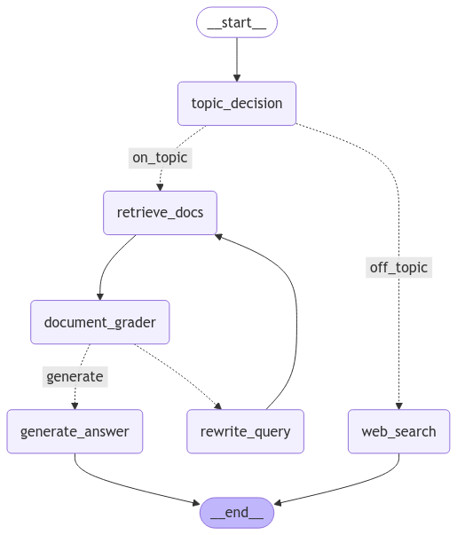

# 🧠 Agentic RAG Medical Assistant

An **intelligent medical assistant chatbot** built on a fine-tuned **LLaMA 3.1 8B** model and a robust **Retrieval-Augmented Generation (RAG)** architecture. This system integrates **domain-specific medical reasoning**, **agentic decision-making**, and **real-time document retrieval** to provide precise, reliable, and context-aware medical responses.

---

## 🚀 Project Highlights

- 🏥 **Domain Expert**: Fine-tuned on curated **medical QA datasets**, enabling reliable and clinically relevant conversations.
- 🧠 **Agentic Intelligence**: Uses **autonomous agents** to decide how to process each query—retrieve documents, rewrite queries, or call external APIs.
- 🗂️ **Smart RAG Pipeline**: Fetches, filters, and grades over **20+ medical resources** using **ChromaDB** and **LangChain** for context-aware retrieval.
- ⚡ **Low-Latency Architecture**: Built with **FastAPI** for rapid, asynchronous interaction—achieving a **40% reduction** in response time.
- 🧪 **Evaluation-Driven**: Achieved **0.29 ROUGE-1** score on medical QA tasks—an excellent result for a compressed and accelerated model.

---

## 🧬 System Architecture

### 🔁 RAG + Agentic Workflow

| Stage | Description |
|-------|-------------|
| **1. Query Ingestion** | User input is parsed and passed through a query classifier. |
| **2. Agent Dispatch** | If query is medical: → document retrieval agent.<br>If query is off-topic: → web search agent (e.g., Wikipedia). |
| **3. Document Retrieval** | Top-k relevant chunks are fetched from **ChromaDB** using embedding similarity. |
| **4. Relevance Scoring** | Retrieved documents are graded for topicality using a scoring model. |
| **5. Response Generation** | LLaMA 3.1 generates a history-aware response using LangChain's `ConversationalRetrievalChain`. |

---

### 📊 Architecture Overview


### 🤖 Agentic Flow



---

## ✨ Features

- 🔍 **Context-Aware Retrieval**  
  Embedding-based document search with ChromaDB for relevance-driven response generation.

- 🧠 **History-Aware Conversations**  
  Maintains conversational memory, allowing contextual understanding over multiple turns.

- 🤖 **Dynamic Query Routing with Agents**  
  Offloads irrelevant questions to search agents (e.g., Wikipedia API), while preserving core medical intent for in-depth answering.

- 📚 **Fine-Tuned LLaMA 3.1 (8B)**  
  Adapted with **PEFT (LoRA)** and **Unsloth** for medical QA and fast inference with reduced resource usage.

- 🧾 **Document Relevance Grading**  
  Prevents hallucination by filtering irrelevant documents prior to generation.

---

## ⚙️ Tech Stack

### 🧠 Language Model

- [LLaMA 3.1 (8B)](https://huggingface.co/meta-llama) - Fine-tuned with LoRA adapters.
- **Unsloth** - Accelerated training with 4-bit quantization.
- **GGUF Format** - Optimized for local inference via Ollama.
- Hosted at:  
  `https://huggingface.co/Rohanpatil02/llama3-ChatDoc`

### 🧠 RAG & Agent Stack

- **LangChain**: Orchestrates document retrieval and LLM chaining.
- **ChromaDB**: High-speed, vector-based document storage and retrieval.
- **Wikipedia API**: Used by the web search agent for general queries.

### 🖥️ Backend & Serving

- **FastAPI**: Asynchronous and scalable backend for chat interface.
- **Ollama**: For serving GGUF models locally.

---

## 🛠️ Setup & Deployment

### 1️⃣ Clone the Repository

```bash
git clone https://github.com/RohanPatil2/Agentic-RAG-Medical-Assistant.git
cd Agentic-RAG-Medical-Assistant
```
2️⃣ Install Dependencies
bash
```
pip install -r requirements.txt
```
3️⃣ Prepare the Environment
✅ Populate the data/ directory with curated medical documents.

✅ Generate embeddings using your fine-tuned LLaMA 3.1 model and store them in ChromaDB.

4️⃣ Pull the Model with Ollama
```
Install Ollama and run:
```
bash
```
ollama pull hf.co/Rohanpatil02/llama3-ChatDoc
```
5️⃣ Run the Application
bash
```
uvicorn app:app --reload
```
📈 Performance & Results
Metric	Value
ROUGE-1 Score	0.29
Query Latency	↓ 40% (via async FastAPI)
Relevance Accuracy	High (via query rewriting + scoring)
📸 Sample Results
✅ History-Aware Medical Query


✅ Dynamic Agent Routing


🔬 Future Enhancements
📖 HIPAA-Compliant Data Filtering

📊 Confidence Scoring with Uncertainty Estimation

🌍 Multilingual Medical Support

🧠 Self-Healing Agent Chains for Long-Term Memory

🤝 Contributing
Contributions are welcome! Please open an issue or submit a PR.

📄 License
This project is licensed under the MIT License. See LICENSE for details.

📫 Contact
Author: Rohan Patil

LinkedIn: RohanPatil2

Email: rohantechdev@gmail.com


---
